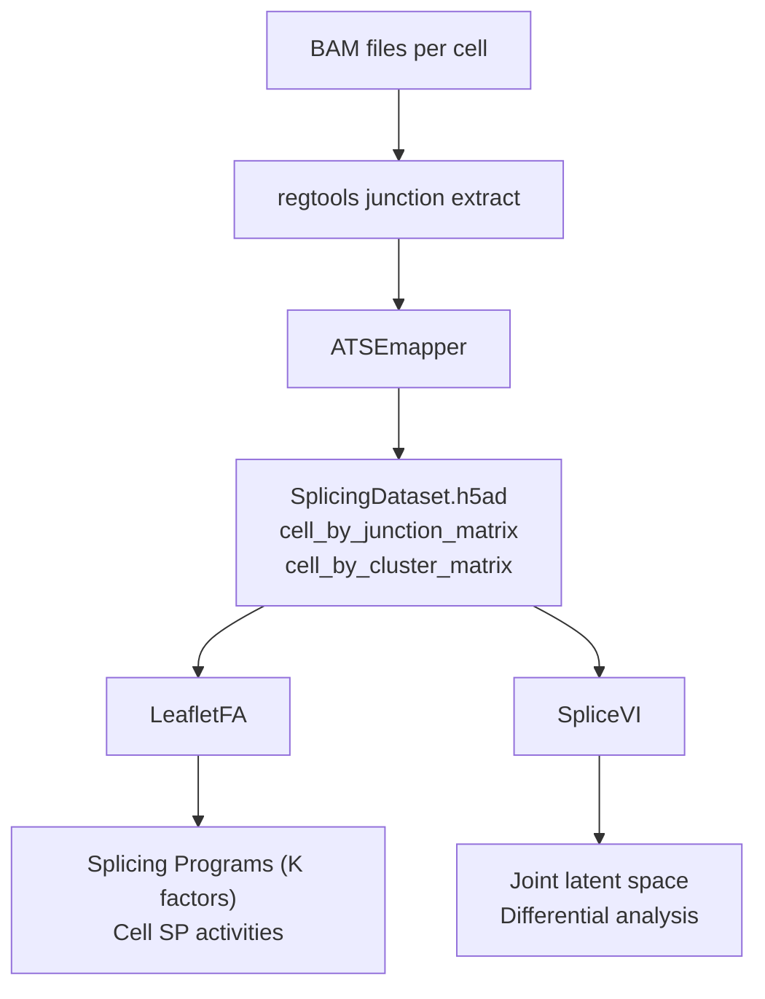

# SpliceVI

SpliceVI is a multimodal variational autoencoder that jointly models **gene expression** and **alternative splicing** (junction usage / PSI) from single-cell data. It learns a shared low-dimensional latent representation from paired or unpaired measurements across both modalities, enabling clustering, trajectory inference, imputation, and differential expression and splicing analysis.

## Ecosystem overview

Three tools form the splicing analysis ecosystem. They share a common intermediate format, **SplicingDataset**, so you can swap models without reformatting data.



| Tool | Role | Repo | Docs |
|------|------|------|------|
| **ATSEmapper** | BAM files → SplicingDataset | [daklab/ATSEmapper](https://github.com/daklab/ATSEmapper) | — |
| **LeafletFA** | Beta-Dirichlet factor model for splicing programs | [daklab/LeafletFA](https://github.com/daklab/LeafletFA) | [docs](https://daklab.github.io/LeafletFA) |
| **SpliceVI** | Multimodal VAE (splicing + gene expression) | [daklab/SpliceVI](https://github.com/daklab/SpliceVI) | this site |

ATSEmapper is the bridge between the bulk-sequencing infrastructure most labs already run and the single-cell-native format both LeafletFA and SpliceVI consume.

## Quick install

```bash
git clone https://github.com/daklab/SpliceVI.git
cd SpliceVI
pip install -e .
```

## Minimal example

```python
import mudata
from splicevi import SPLICEVI

mdata = mudata.read_h5mu("train_data.h5mu")

SPLICEVI.setup_mudata(
    mdata,
    rna_layer="length_norm",
    batch_key="mouse.id",
)

model = SPLICEVI(mdata, n_latent=30)
model.train(max_epochs=800)

latent = model.get_latent_representation()   # (cells × n_latent) joint latent space
psi    = model.get_normalized_splicing()     # (cells × junctions) imputed PSI values
```

See [SpliceVI model](models/splicevi.md) for the full parameter reference and [SpliceVI MuData Object](data-format.md) for the expected input structure.

## Citation

If you use SpliceVI, please cite:

> Vaidyanathan S, Isaev K, Zweig A, Knowles DA. *Robust Integration of Sparse Single-Cell Alternative Splicing and Gene Expression Data with SpliceVI*. bioRxiv 2025. https://doi.org/10.1101/2025.11.26.690853
