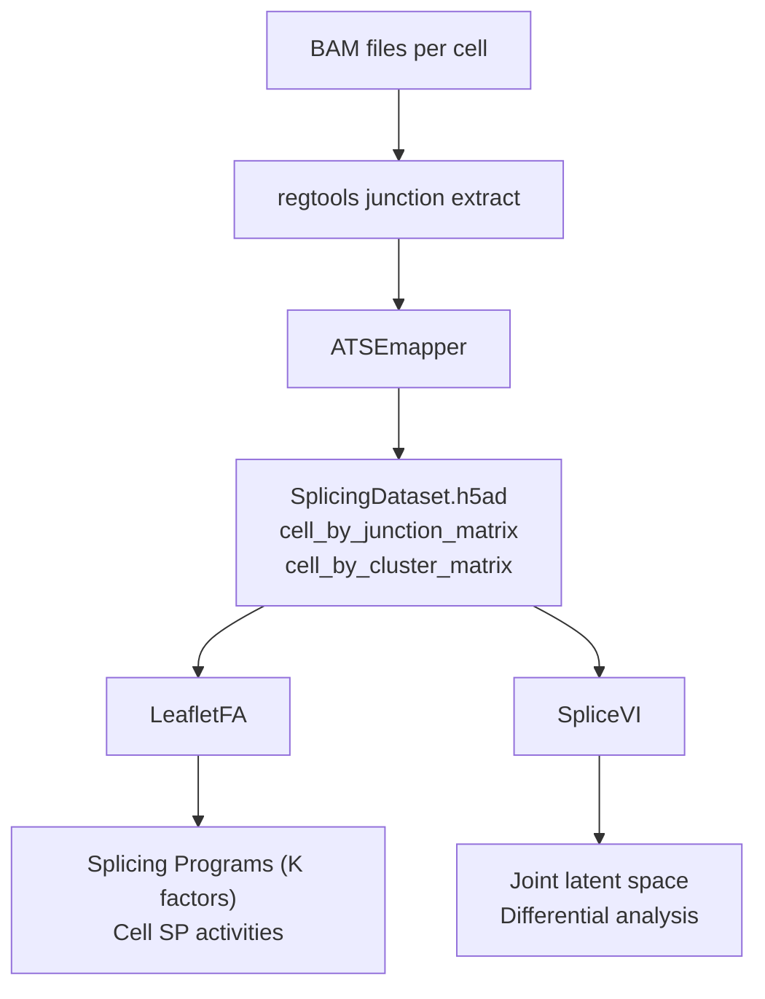

# SpliceVI

**Multimodal VAE for joint modeling of alternative splicing and gene expression from single-cell data.**

SpliceVI learns a shared latent representation from paired (or unpaired) gene expression and alternative splicing (junction usage / PSI) measurements. It is built on [scvi-tools](https://github.com/scverse/scvi-tools) and designed to handle the high missingness and count-based structure of splicing data in single-cell experiments.

---

## Splicing analysis ecosystem

SpliceVI is part of a suite of tools from the [Knowles Lab](https://daklab.github.io/) that share a common intermediate format — **SplicingDataset** — so data prepared for one tool works directly with the others.



| Tool | Role | Repo | Docs |
|------|------|------|------|
| **ATSEmapper** | BAM files → SplicingDataset | [daklab/ATSEmapper](https://github.com/daklab/ATSEmapper) | — |
| **LeafletFA** | Beta-Dirichlet factor model for splicing programs | [daklab/LeafletFA](https://github.com/daklab/LeafletFA) | [docs](https://daklab.github.io/LeafletFA) |
| **SpliceVI** | Multimodal VAE (splicing + gene expression) | [daklab/SpliceVI](https://github.com/daklab/SpliceVI) | this site |

---

## Key features

- Joint encoder–decoder architecture with separate branches for gene expression and splicing
- Handles **missing splicing observations** per cell via a missingness-aware partial encoder
- Flexible splicing likelihoods: **Binomial**, **Beta-Binomial**, and **Dirichlet-Multinomial**
- Multiple modality mixing strategies (equal, universal, per-cell, concatenate)
- Built-in support for batch correction, covariates, and differential splicing analysis

---

## Installation

```bash
conda create -n splicevi-env python=3.12
conda activate splicevi-env

git clone https://github.com/daklab/SpliceVI.git
cd SpliceVI
pip install -e .
```

For Weights & Biases logging:

```bash
pip install wandb
```

---

## Quick start

```python
import mudata
from splicevi import SPLICEVI

mdata = mudata.read_h5mu("your_data.h5mu")

SPLICEVI.setup_mudata(mdata, ...)

model = SPLICEVI(mdata, n_latent=30)
model.train(max_epochs=400)

latent = model.get_latent_representation()
```

---

## Citation

If you use SpliceVI, please cite:

> Vaidyanathan S, Isaev K, Zweig A, Knowles DA. *Robust Integration of Sparse Single-Cell Alternative Splicing and Gene Expression Data with SpliceVI*. bioRxiv 2025. https://doi.org/10.1101/2025.11.26.690853
